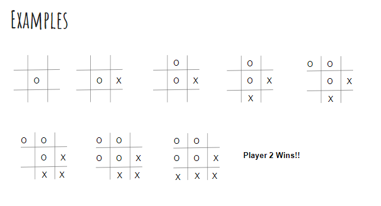

<!-- 이 레포지토리는 과거에 받은 질문내용을 정리하여 재 구성한 것입니다. -->

# What is Tic-Tac-Toe?

* 3 x 3 바둑판위에서 2명의 플레이어가 수행하는 게임
  - 두 플레이어는 서로 번갈아가면서 자신의 마크를 바둑판 위에 놓음
  - 플레이어 1은 ‘O’ 마크, 플레이어 2는 ‘X’ 마크를 바둑판 위에 둘 수 있음
  - 두 플레이어 중 먼저 3개의 마크를 가로, 세로, 대각선에 1줄로 놓는 플레이어가 승리
  - 만약 3 x 3 바둑판을 모두 채울 때까지 단 한 플레이어도 3개의 마크를 1줄로 놓지 못했다면, 무승부

# Example

# Goal of this project
* 2명의 플레이어가 번갈아가며 Tic-Tac-Toe 게임을 하는 Python 프로그램 작성
  - 프로그램 실행 시, Player 1부터 게임을 시작
  - Player 1에게 마크를 놓고 싶은 바둑판의 (x,y) 좌표를 입력으로 받음
    + (0,0)이 왼쪽 상단 모서리 좌표, (2,2)가 오른쪽 하단 모서리 좌표. 범위를 초과하는 숫자를 입력했다면 범위를 초과했다는 메시지와 함께 좌표를 다시 물어봄
    + 만약 이미 마크가 놓인 바둑판 좌표를 입력했다면, 이미 마크가 있다는 메시지와 함께 좌표를 다시 물어봄
  - 올바른 좌표를 입력했다면 해당 위치에 마크를 표시하고, 현재까지 바둑판에 어떤 마크들이 놓여있는지 바둑판 모양으로 출력
    + 만약 게임의 승패가 판별 났다면, 승자가 누구인지 출력하고 프로그램 종료
    + 만약 게임이 무승부로 판별 났다면, 무승부라고 출력하고 프로그램 종료
  - Player 2에 대해 위 동일 절차를 수행, 그리고 다시 Player 1에 대해 위 동일 절차를 수행
    + 게임이 끝날 때 까지 반복

# Project guideline (Cont’d)
* 채점 기준
  - 게임의 기능들이 제대로 구현되었으면 - 50%
    + 좌표 입력 시 마크를 제대로 바둑판에 두고 출력 할 수 있어야함
    + 게임 종료 시 승, 패, 무승부 여부를 올바르게 출력 할 수 있어야 함
  - 함수 (Function)을 하나라도 만들어서 구현하면 - 20%
  - 반복문 (While, For)을 한번이라도 사용하였으면 - 10%
  - If문을 한번이라도 사용하였으면 - 10%
  - 보고서를 작성하여 제출하였으면 - 10%
